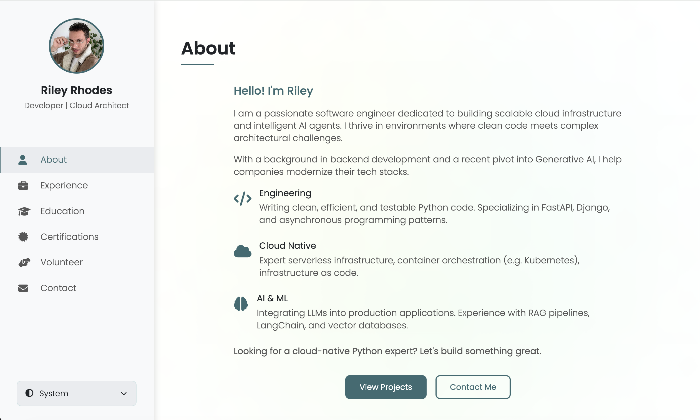
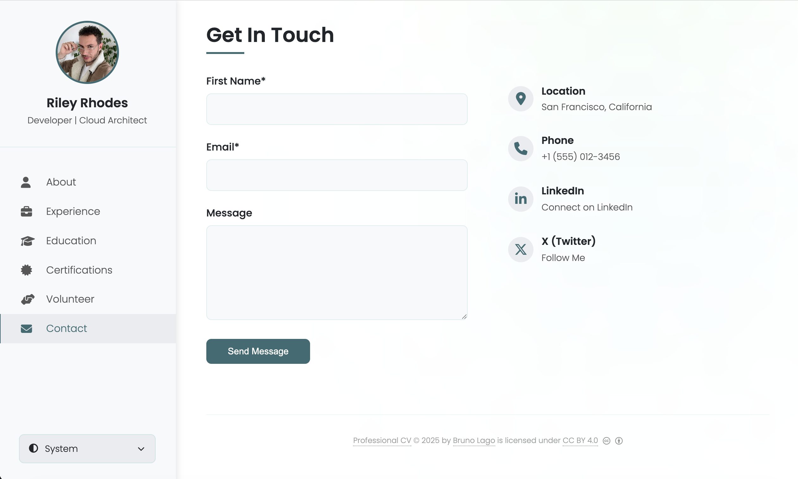
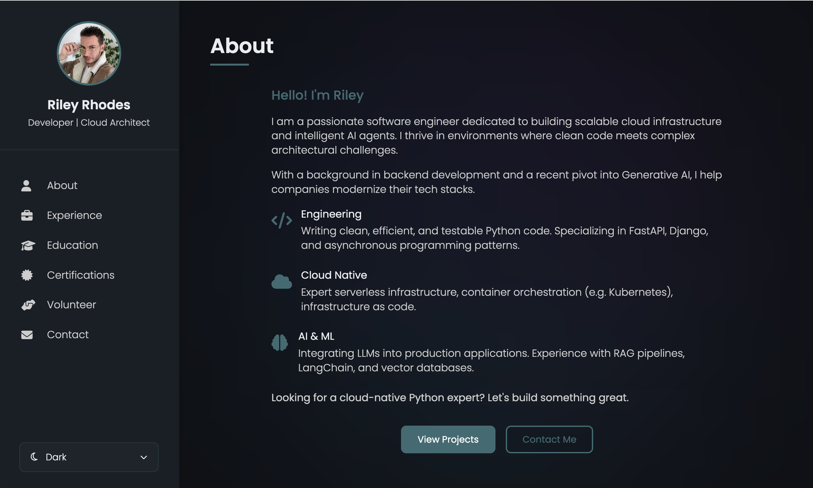

# Professional CV

A modern, single-page CV website generator that transforms your career data into a beautiful, responsive HTML page. Perfect for professionals who want a clean, customisable online presence without using social media platforms, or the complexity of CMS platforms.

## Preview

Here are some screenshots of the application in action:




## Features

- **Adaptive Theme**: System-aware dark and light modes with manual override
- **Fully Responsive**: Seamless experience across desktop, tablet, and mobile devices
- **Professional Cards**: Clean, card-based layouts for experience, education, certifications, and volunteer work
- **YAML-Powered**: Simple, human-readable YAML configuration for all content
- **Zero Dependencies**: Pure HTML, CSS, and JavaScript—no frameworks, no build tools required for deployment
- **Smooth Animations**: Polished UI with smooth scrolling and transitions
- **SEO Optimised**: Comprehensive meta tags, Open Graph, and Schema.org JSON-LD for maximum visibility
- **Analytics Ready**: Built-in Google Analytics support
- **Social Integration**: Automatic social media link discovery for SEO and contact display
- **Graceful Fallbacks**: Colourful gradient placeholders for missing images, intelligent section hiding when empty, system theme detection
- **Browser Compatible**: Works on all modern browsers (Chrome, Edge, Firefox, Safari, Opera, and mobile browsers)

## Quick Start

### Recommended: Build from Source

This is the recommended approach as it keeps your content separate from presentation and allows easy updates.

#### 1. Get the Code

```bash
# Clone the repository
git clone https://github.com/yourusername/professional-cv.git
cd professional-cv

# Or download and extract the ZIP
```

#### 2. Set Up Your Environment

**Linux / macOS:**
```bash
# Create virtual environment
python3 -m venv venv

# Install dependencies
./venv/bin/pip install -r requirements.txt
```

**Windows:**
```cmd
# Create virtual environment
python -m venv venv

# Install dependencies
venv\Scripts\pip install -r requirements.txt
```

#### 3. Customise Your Content

Edit `cv.yaml` with your information:

```yaml
basics:
  name: "Your Name"
  label: "Your Title"
  email: "your@email.com"
  # ... more fields
```

#### 4. Build Your CV

**Linux / macOS:**
```bash
./venv/bin/python build.py
```

**Windows:**
```cmd
venv\Scripts\python build.py
```

#### 5. View Your CV

Open `index.html` in your browser:

```bash
open index.html        # macOS
xdg-open index.html    # Linux
start index.html       # Windows
```

### Alternative: Direct HTML Editing

If you prefer not to use the build system, you can download just the `index.html` file and edit it directly. This approach is **not recommended** as it's more error-prone and harder to maintain.

1. Download `index.html`
2. Create an `images/` folder in the same directory
3. Place your profile picture and any company logos in `images/`
4. Open `index.html` in a text editor
5. Find the `<script>` section containing `const cvData = {`
6. Edit the JSON object with your information
7. Update the `<title>` and `<meta name="description">` tags in the `<head>` section

**Note:** When editing JSON directly, be careful with commas, quotes, and brackets. One syntax error will break the entire page.

## Project Structure

```
professional-cv/
├── cv.yaml              # Your CV content
├── theme.yaml           # Colour theme configuration (light & dark modes)
├── template.html        # HTML template with design and functionality
├── build.py             # Build script to generate index.html
├── requirements.txt     # Python dependencies
├── LICENSE              # CC BY 4.0 license
├── README.md            # This file
├── index.html           # Generated CV website (created by build.py)
├── images/              # Store your images and icons here
│   ├── (your-photo.jpg)
│   ├── (company-logo-1.png)
│   └── (company-logo-2.png)
└── venv/                # Virtual environment (created during setup)
```

## Build Script

The `build.py` script combines your YAML content with the HTML template and theme configuration to generate a complete, self-contained website.

### What It Does

1. Reads your CV data from `cv.yaml`
2. Loads theme colours from `theme.yaml`
3. Injects colours into the template CSS
4. Converts YAML to JSON and embeds it in the HTML
5. Generates SEO tags (title, description)
6. Outputs a single `index.html` file

### Default Files

- **CV Data**: `cv.yaml`
- **Template**: `template.html`
- **Theme**: `theme.yaml`
- **Output**: `index.html`

### Custom Configuration

Override defaults using command-line parameters:

```bash
# Use custom CV file
./venv/bin/python build.py --cv my-cv.yaml

# Use custom template and theme
./venv/bin/python build.py --template my-template.html --theme my-theme.yaml

# Specify output file
./venv/bin/python build.py --output my-cv.html

# Combine all options
./venv/bin/python build.py --cv my-cv.yaml --template my-template.html --theme my-theme.yaml --output my-cv.html
```

## Customisation

### Profile Picture

Add your profile picture to the `images/` directory and reference it in `cv.yaml`:

```yaml
basics:
  image: "images/your-photo.jpg"
```

### Company and Organisation Logos

Add logos for experience, education, certifications, courses, and volunteer entries:

```yaml
work:
  - name: "Company Name"
    logo: "images/company-logo.png"
    logoText: "CN"  # Fallback text if logo fails to load
```

If no logo is provided, a colourful gradient placeholder with the `logoText` initials will be displayed automatically.

### Colours

Customise the theme colours in `theme.yaml`:

```yaml
light:
  primary_color: "#3a6b72"
  text_primary: "#212529"
  bg_primary: "#ffffff"

dark:
  primary_color: "#3a6b72"
  text_primary: "#e9ecef"
  bg_primary: "#0e1015"
```

After modifying `theme.yaml`, run `build.py` to regenerate your CV with the new colours.

### Fonts

The template uses Google Fonts (Poppins). To change fonts:

1. Open `template.html`
2. Update the Google Fonts `<link>` tag in the `<head>` section
3. Update the `font-family` in the CSS

### Social Media Links

Add social media links in `cv.yaml` under `basics.contact`:

```yaml
basics:
  contact:
    - icon: "fab fa-linkedin-in"
      heading: "LinkedIn"
      content: "View Profile"
      link: "https://www.linkedin.com/in/your-profile/"
      type: "link"
      social: true  # Include in SEO metadata
```

Supported platforms: LinkedIn, Facebook, YouTube, Instagram, TikTok, X (Twitter), WhatsApp, Signal, Telegram, Messenger

**Note:** Only entries with valid links will be displayed.

### Contact Form

The contact form uses [Web3Forms](https://web3forms.com/) (free):

1. Create an account at [Web3Forms](https://web3forms.com/)
2. Get your Access Key
3. Add it to `cv.yaml`:

```yaml
basics:
  form-api-key: "YOUR-WEB3FORMS-ACCESS-KEY"
```

### Google Analytics

Track visitors to your CV:

1. Create a Google Analytics 4 property
2. Copy your Measurement ID (e.g., `G-XXXXXXXXXX`)
3. Add it to `cv.yaml`:

```yaml
basics:
  analytics-id: "G-XXXXXXXXXX"
```

To disable analytics, remove the field or leave it empty.

## Graceful Fallbacks

The CV gracefully handles missing or incomplete data:

- **Missing Images**: Displays colourful gradient placeholders with initials
- **Empty Sections**: Automatically hides sections with no content (experience, education, volunteer, etc.)
- **Missing Theme**: Falls back to template defaults if `theme.yaml` is not found
- **No Analytics ID**: Analytics script only loads when ID is provided
- **No Contact Form Key**: Form still renders but won't submit

## License

This project is licensed under [Creative Commons Attribution 4.0 International (CC BY 4.0)](https://creativecommons.org/licenses/by/4.0/).

You are free to:
- **Share**: Copy and redistribute the material in any medium or format
- **Adapt**: Remix, transform, and build upon the material for any purpose, even commercially

Under the following terms:
- **Attribution**: You must give appropriate credit, provide a link to the license, and indicate if changes were made

Use the following HTML code for attribution:
```html
<a href="https://github.com/teolupus/professional-cv">Professional CV</a> © 2025 by <a href="https://www.blissful.im">Bruno Lago</a> is licensed under <a href="https://creativecommons.org/licenses/by/4.0/">CC BY 4.0</a>
```

Use the following plain text reference for attribution in other media:
```
Professional CV [https://github.com/teolupus/professional-cv] © 2025 by Bruno Lago [https://www.blissful.im] is licensed under CC BY 4.0. [https://creativecommons.org/licenses/by/4.0/]
```

See the [LICENSE](LICENSE) file for details.

## Contributing

Contributions are welcome! If you'd like to improve this project:

1. Fork the repository
2. Create a feature branch (`git checkout -b feature/amazing-feature`)
3. Commit your changes (`git commit -m 'Add amazing feature'`)
4. Push to the branch (`git push origin feature/amazing-feature`)
5. Open a Pull Request

Please ensure your code follows the existing style and includes appropriate documentation.

## Support

If you encounter any issues or have questions, please [open an issue](https://github.com/yourusername/professional-cv/issues) on GitHub.
